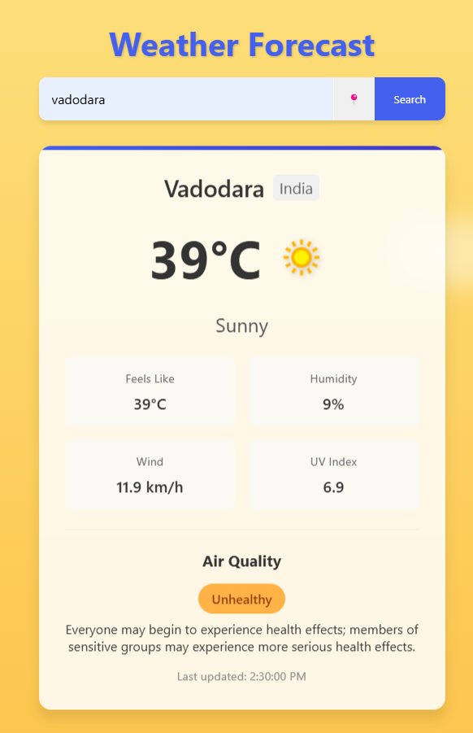
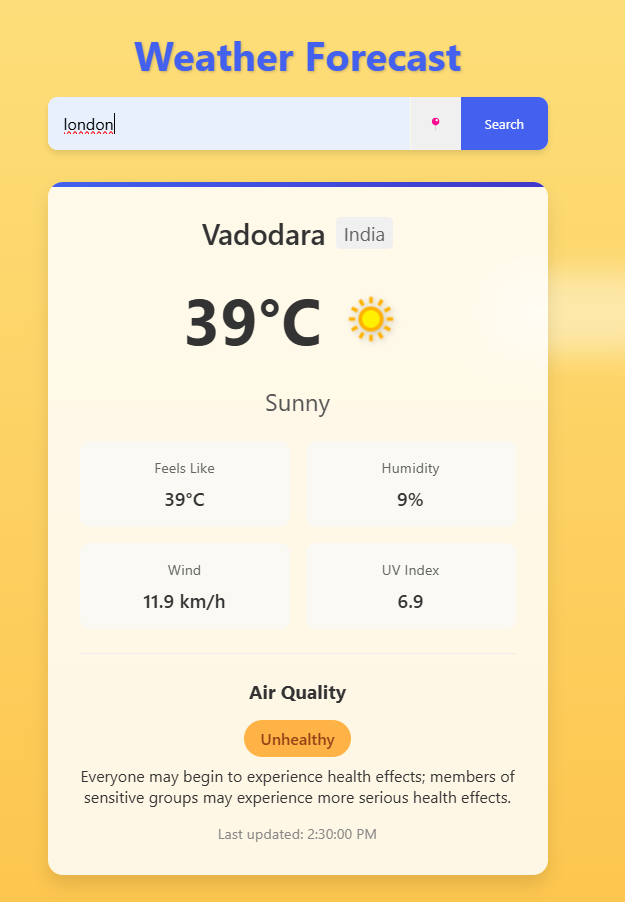
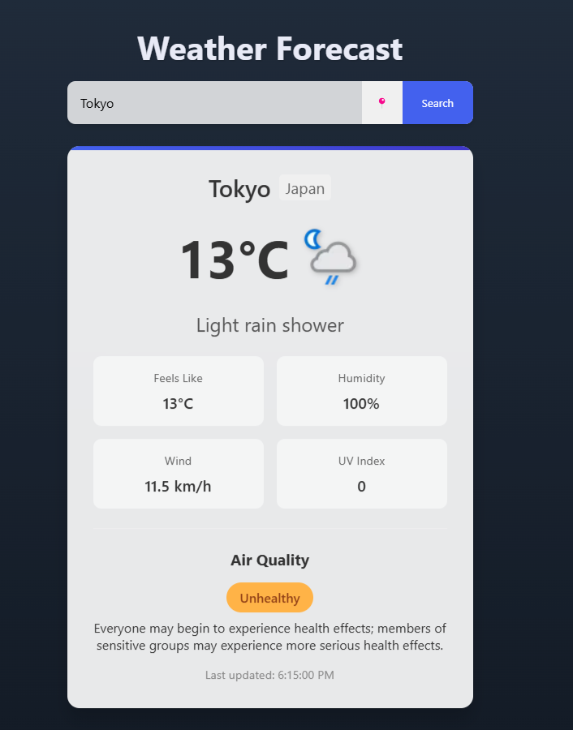
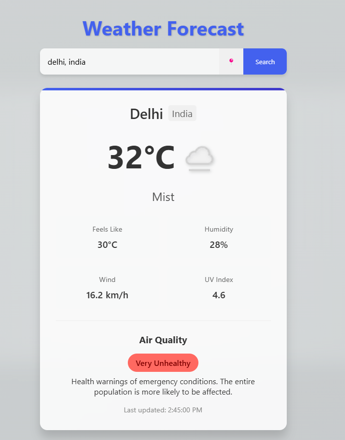
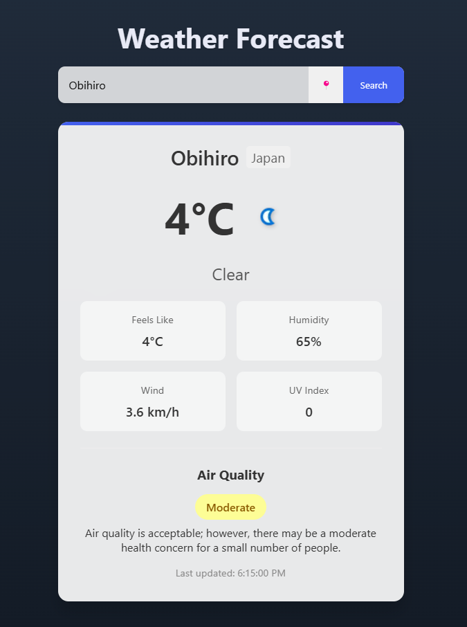

# Weather-App
# Weather App

## Overview
The Weather App is a dynamic application that provides real-time weather updates for any location. It fetches weather data from an API and updates the UI with corresponding animations, backgrounds, and temperature details.

## Features
- Real-time weather updates
- Dynamic background changes based on weather conditions
- Temperature, humidity, and wind speed display
- Search functionality for different cities
- User-friendly and responsive UI

## Technologies Used
- **Frontend:** HTML, CSS, JavaScript
- **API:** OpenWeatherMap API (or any other weather API you are using)
- **Libraries:** Axios (for API requests), GSAP (for animations), Tailwind CSS (for styling)

## Installation & Setup
1. Clone the repository:
   ```sh
   git clone https://github.com/your-username/weather-app.git
   cd weather-app
   ```
2. Install dependencies (if using npm or a package manager):
   ```sh
   npm install
   ```
3. Get an API key from [OpenWeatherMap](https://openweathermap.org/api) and add it to your JavaScript file.
4. Run the project:
   ```sh
   npm start
   ```

## Usage
1. Enter the city name in the search bar.
2. The app fetches weather data and updates the UI dynamically.
3. The background and animations adjust based on the current weather conditions.

## Screenshots






## Future Enhancements
- Add hourly and weekly forecasts
- Implement geolocation-based weather updates
- Improve UI animations and transitions

## Contributing
Pull requests are welcome. For major changes, please open an issue first to discuss the changes.

## Contact
For questions or feedback, visit [your GitHub profile](https://github.com/Sweetsmile4).
